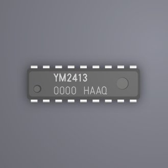
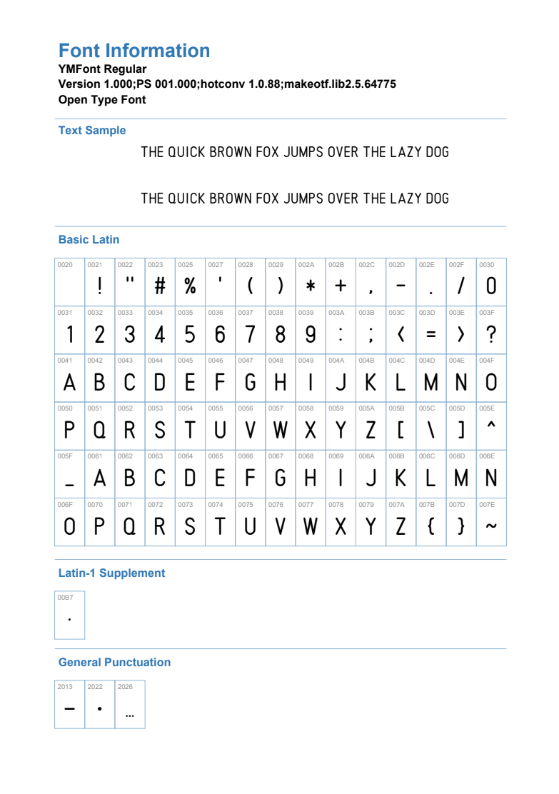

# YMFont

YMFont is a basic latin open type font inspired by characters on 80's retro LSI chip surface.

# Example

# Fonts

# Download
- [YMFont-Regular.otf](./dist/YMFont-Regular.otf)

# LICENSE
MIT

